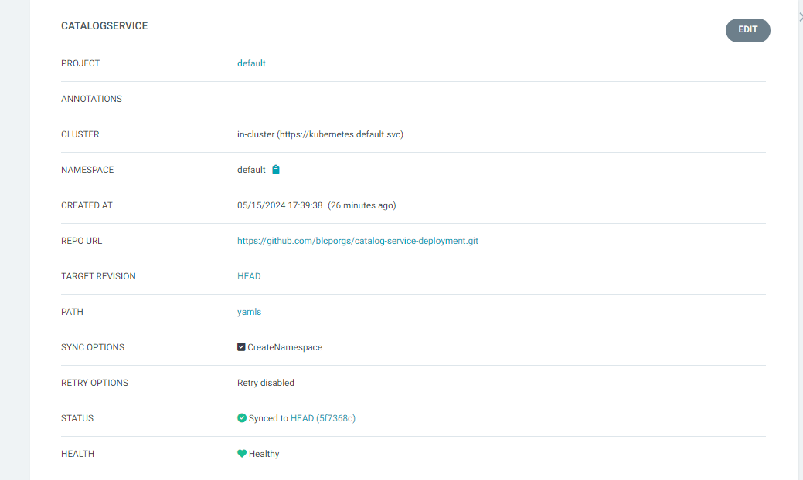
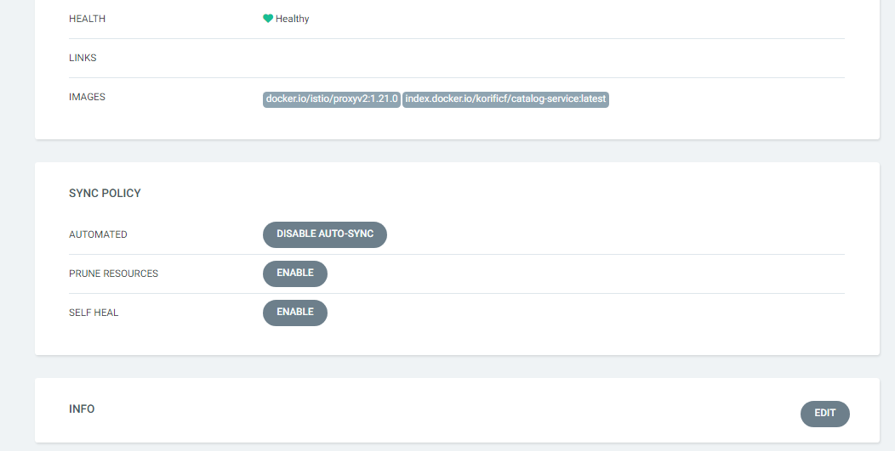

* GitHub:
  Create the GitHub Repo with  the yamls that were created as part of the move2kube transformation .
  which will be available under the
  myproject/deply/ folder
  and also the argocd yaml available under the myproject/deploy/cicd/argocd.
  Edit the argocd.yaml file to add the below entries 
```
https://github.com/blcporgs/catalog-service-deployment/
```

* argocd.yaml
```
apiVersion: argoproj.io/v1alpha1
kind: Application
metadata:
  name: catalogservice
  namespace: argocd
spec:
  destination:
    server: https://kubernetes.default.svc
    namespace: default
  project: "default"
  syncPolicy:   
    syncOptions:
    - CreateNamespace=true
    automated:
      selfHeal: true
      prune: true

  source:
    path: yamls
    repoURL:  https://github.com/blcporgs/catalog-service-deployment.git
```

* ArgoCD Configuration for application deployment





